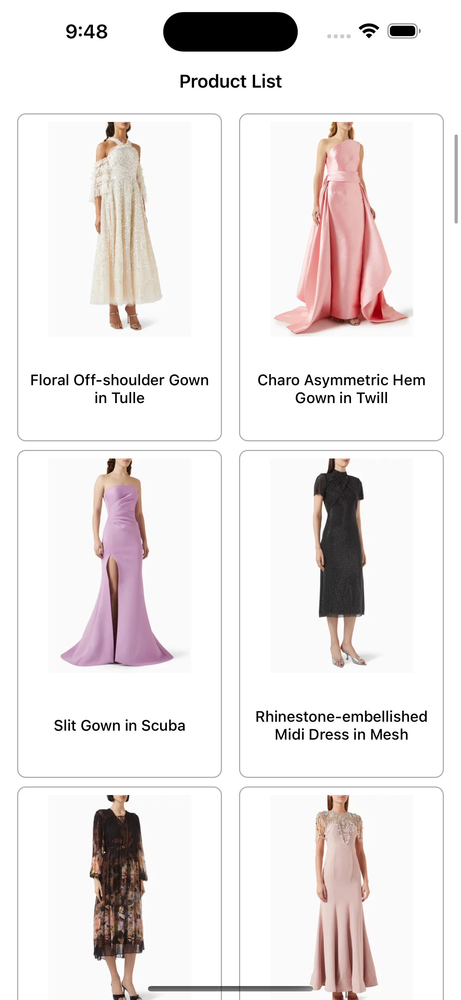
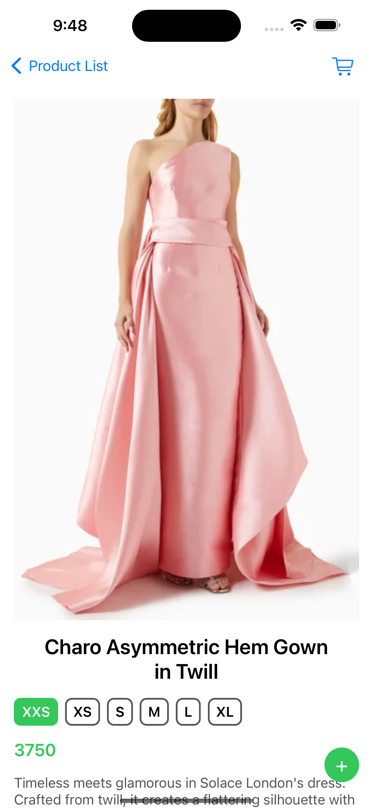

# OunassCase

## Tech Stack

- **Xcode Version:** 16.2
- **iOS Deployment Target:** iOS 15
- **Third-party Dependencies:** SDWebImage, UILab, NLab
- **Project Generation Tool:** XcodeGen 2.42.0
- **Architecture:** VIPER
- **Unit Tests:** Implemented for `ProductListModule`

### Installation 
To install **XcodeGen** and generate `.xcodeproj` files, run the following command in the project root directory:
```bash
brew install xcodegen && xcodegen generate
```

### Screenshots
| 1 | 2 |
|---|--|
|  |  |

## Project Structure

```
.
├── App
│   └── Application (Main application entry point)
├── Kits
│   ├── CommonKit (Common utilities and extensions)
│   ├── CommonViewKit (UI Components used across modules)
│   ├── DependencyManagerKit (Dependency Management)
│   ├── NetworkManagerKit (Base API and networking logic)
│   └── BasketManagerKit (Basket logic and management)
├── Modules
│   ├── ProductListModule (Product listing feature)
│   ├── ProductDetailModule (Product detail page)
│   └── BasketListModule (Basket listing feature)
├── Tests
│   └── ProductListModuleTests
└── XcodeGen Project.yml
```

### Dependency Graph

